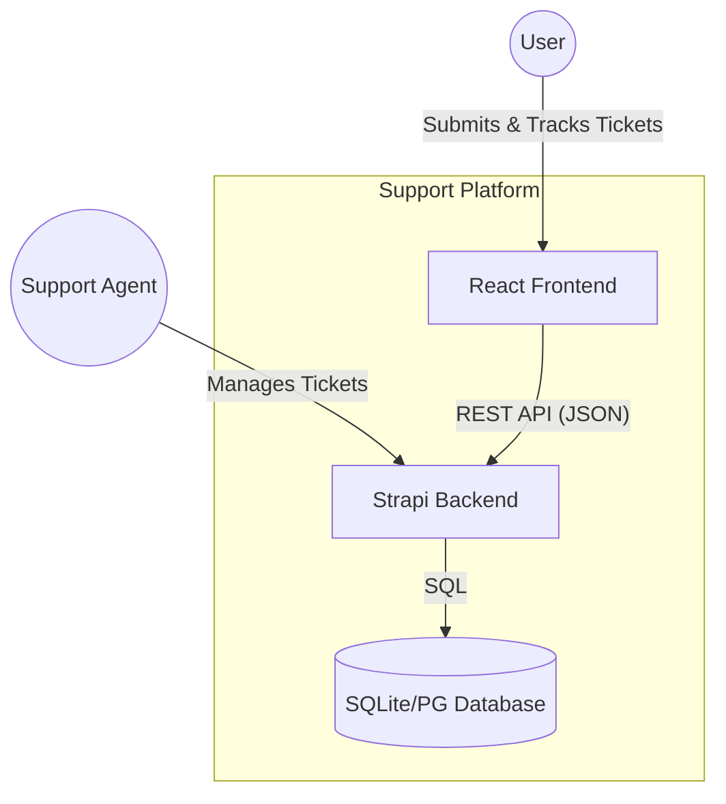
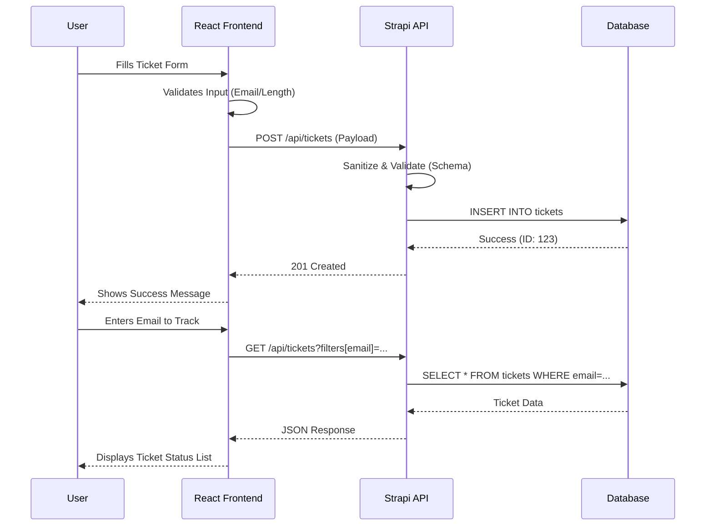
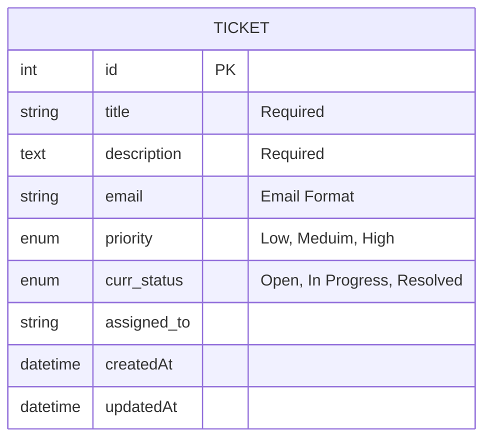
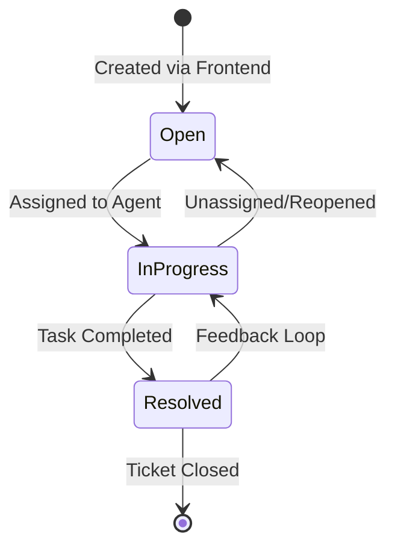

# Architecture Master Plan: Support Ticket System

## 1. High-Level Architecture
The system follows a **Decoupled Client-Server Architecture** utilizing a **Headless CMS (Strapi)** as the backend and a **Single Page Application (React)** as the frontend. This pattern ensures high developer productivity and a clean separation of concerns.

### Architectural Pattern
- **Frontend**: Component-based SPA using React 19.
- **Backend**: Plugin-based Headless CMS (Strapi 5) with an integrated REST API.
- **Database**: File-based SQLite (Development) / Relational SQL (Production).

---

## 2. Mermaid Diagrams

### 2.1 System Context Diagram
Shows how the platform interacts with users and internal/external boundaries.

### 2.2 Sequence Diagram: Ticket Submission & Tracking
Mapping the critical journey from ticket creation to status retrieval.

### 2.3 Entity-Relationship Diagram (ERD)
Visualizing the Strapi Content Type schema.

### 2.4 State Machine Diagram: Ticket Lifecycle
Defines the valid transitions for a ticket's status.

---

## 3. Workload & Traffic Analysis

### Potential Bottlenecks
1. **SQLite Concurrent Writes**: As a file-based DB, SQLite may face locking issues under high concurrent write loads (ticket storms).
2. **Hardcoded API Latency**: The client-side fetching in `AllTicketsPeek.js` triggers on every open, which could spike backend traffic if the dashboard is frequented.
3. **Payload Mapping**: The manual mapping of `Medium` to `Meduim` in the frontend adds a small but redundant processing overhead.

### Distribution Strategy
- **Client-Side Rendering (CSR)**: Continue using CSR for the interactive dashboard to maintain the "App-like" feel.
- **Backend Caching**: Propose using a Strapi REST Cache plugin for the `AllTicketsPeek` endpoint to reduce DB hits for frequently requested global recent tickets.
- **Edge Assets**: High-resolution hero images should be served via CDN to reduce load on the primary server.

---

## 4. Integration Strategy
To plug new modules (e.g., AI Analysis) into the legacy setup:
- **Middleware Layer**: Create a custom Strapi controller/service for the new module.
- **Type Safety**: Introduce TypeScript interfaces for the API responses to prevent "typo-debt" (like `Meduim`) from propagating.
- **Versioned Components**: When upgrading components, maintain the `index.css` variable system to ensure design consistency.

---

## 5. Security & Scalability

### Environment Management
- Move all instances of `http://localhost:1337` to `process.env.REACT_APP_API_URL`.
- Backend secrets (APP_KEYS) must be stored in a `.env` file and never committed.

### API Rate Limiting
- Implement `strapi-middleware-rate-limit` to prevent brute-force ticket submissions or scraping of the global activity feed.

### Caching
- **Browser Caching**: Set appropriate `Cache-Control` headers for assets.
- **Server Caching**: Implement Redis or internal Strapi caching for the `/api/tickets` list endpoints.
